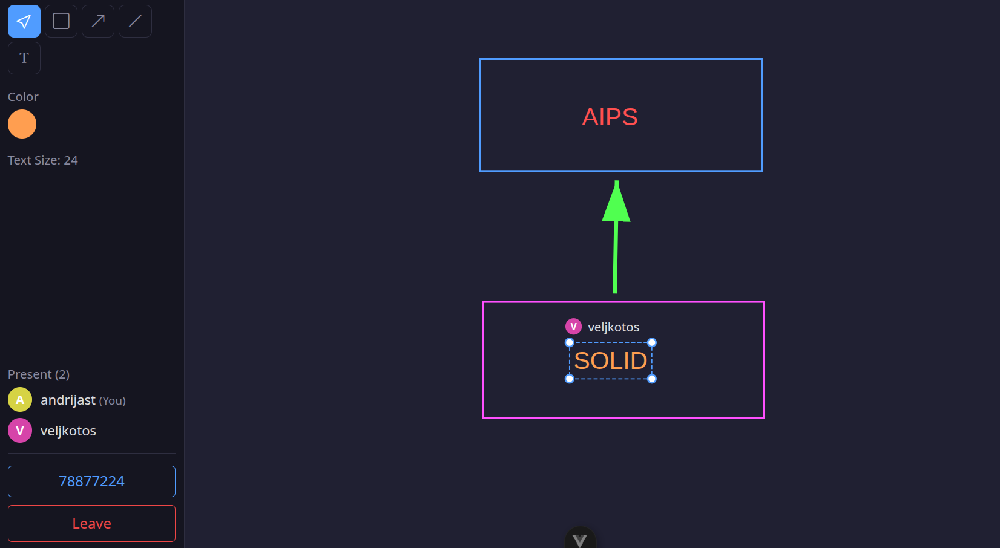
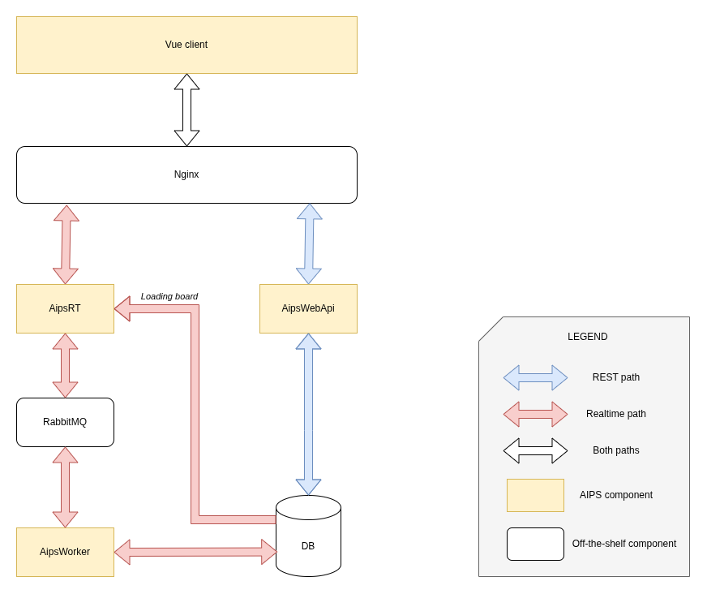

# AIPS (Advanced Interactive Painting System)

A real-time collaborative whiteboard. One user creates a board and shares it, and several participants then draw on it at the same time, with every change showing up for everyone right away. The available shapes are rectangle, line, arrow and text. The board owner controls who gets in: depending on the join policy a participant either walks straight in, waits to be approved, or is refused outright. Authentication is JWT with refresh tokens.



A board in session. Everyone present is listed in the sidebar, every shape carries the name of whoever drew it, and the eight digit code under the list is what other people use to get in.

## Architecture



There are two paths through the system. Drawing takes the fast one: the realtime service keeps the board in memory, answers from there and broadcasts to everyone on the board, then hands the change to a queue for somebody else to save. Everything that is not drawing (signup, login, creating and deleting boards, history, joining by code) takes the ordinary REST path through the Web API. The two run as separate processes and meet again at the database.

### What happens when you draw a shape

1. The client draws and invokes a hub method over **SignalR** (`AddRectangle`, `MoveShape` and so on).
2. **AipsRT** (the realtime service) changes the board in its **in-memory** state and immediately broadcasts that change to the other participants on the board.
3. At the same time, RT publishes a message (`AddRectangleMessage`, `MoveShapeMessage`) to a **RabbitMQ** topic exchange.
4. **AipsWorker** picks the message up and turns it into a command. The domain validates its rules and the result is written to **PostgreSQL**.
5. If validation fails, the Worker publishes an `ErrorMessage`. RT receives it, reloads the board from the database and sends `InitWhiteboard` to everyone, so the in-memory state goes back to whatever was actually saved.

So drawing feels instant, because nothing waits on the database, but the database is still the source of truth and it corrects memory whenever the two drift apart.

### What happens when someone joins

1. The visitor enters the eight digit code, a plain REST call to `POST /api/Whiteboard/join`. The board's join policy decides what the membership starts as: `FreeToJoin` accepts on the spot, `RequestToJoin` leaves it pending, `Private` refuses.
2. The client then opens the hub connection and calls `JoinWhiteboard`. RT loads the board into memory if nobody is on it yet, joins the SignalR group and reads the membership status from the database.
3. Accepted goes straight in, `InitWhiteboard` to the newcomer and `Joined` to the group. Pending gets `WaitingForApproval`, and the owner alone gets `UserWaitingForApproval`.
4. `AcceptUser` then does the same two things a shape does: publish `AcceptUserRequestToJoinMessage` for the Worker to persist, and let the user in immediately without waiting for that.

Drawing is not a special case in the code, just the loudest one. Membership goes through the same split.

## Components

One row per box on the diagram, in the same order:

| Box on the diagram | Code / config | Role |
|---|---|---|
| **Vue client** | `front/`, Vue 3, TypeScript, Vite, Pinia | SPA with an SVG canvas, `fetch` for REST and `@microsoft/signalr` for the hub |
| **Nginx** | `deploy/nginx/` | The single entrypoint: `/api/` to AipsWebApi, `/hubs/` to AipsRT with a WebSocket upgrade, everything else the static SPA build. Deployment only, since Vite proxies in development |
| **AipsRT** | `dotnet/AipsRT/`, ASP.NET Core with SignalR | Hub at `/hubs/whiteboard`. Holds active boards in memory (`WhiteboardManager`), broadcasts to the board group, publishes messages, listens for `ErrorMessage` |
| **AipsWebApi** | `dotnet/AipsWebApi/`, ASP.NET Core Web API | `/api/User/*` for signup, login, refresh, logout and me. `/api/Whiteboard/*` for create, get, delete, history, recent and join |
| **RabbitMQ** | `rabbitmq:3-management` via Docker | Topic exchange. Routing key and queue name are both the message type name, acknowledged manually |
| **AipsWorker** | `dotnet/AipsWorker/`, .NET Worker Service | Runs drawing and membership messages as commands, saves the result, publishes `ErrorMessage` on validation failure |
| **DB** | `postgres:18` via Docker | Users, whiteboards, shapes, memberships and refresh tokens |

### AipsCore, the shared library

`dotnet/AipsCore` has no box on the diagram because it isn't a process. It is the class library all three services are built on, and most of the design sits in it:

- `Domain` for models, value objects and validation rules
- `Application` for commands, queries, messages, their handlers and the dispatcher that routes them
- `Infrastructure` for EF Core and migrations, the RabbitMQ publisher and subscriber, JWT and the DI wiring

## Why it is built this way

**The realtime service is separate from the Web API.** One holds WebSocket connections and per board state, the other answers stateless requests and forgets them. Connection state never sits in the REST process, and either can restart without taking the other down.

**A board lives in memory while people are drawing on it.** A database round trip per stroke is latency the person drawing would feel. The cost is that RT is stateful: a live board belongs to one instance and does not survive a restart, so it is rebuilt from the database on the next join.

**Persistence goes through a broker instead of a direct write.** The interactive path never waits on the database, and the Worker can be slow or restarting without anyone noticing. What you give up is immediacy, and since messages are not requeued, one that fails is a change that quietly did not happen.

**Mistakes are corrected afterwards rather than prevented up front.** RT could validate before broadcasting, but then the same rules would live in two places and drift. Keeping one copy in the domain means an invalid change is briefly visible, until the `ErrorMessage` comes back and RT re-initialises the board.

**Three entrypoints, one set of handlers.** A hub call, an HTTP request and a broker message all reach the same dispatcher, so a rule cannot behave one way over REST and another way over the hub.

**Domain models are kept apart from the EF entities.** Value objects cannot be constructed in an invalid state, and the mapping to storage is written by hand in both directions. It costs a set of mapper classes, and no persistence concern reaches the rules.

## Where to look in the code

The frontend is a thin client. Almost all of the design is on the .NET side, roughly in this order:

| Path under `dotnet/` | What it is |
|---|---|
| `AipsRT/Hubs/WhiteboardHub.cs` | The entire realtime surface. Every drawing action updates the in-memory board, publishes a message and broadcasts to the group |
| `AipsWorker/WorkerService.cs` | Subscribes to every message type, runs each one as a command, turns a `ValidationException` into an `ErrorMessage` |
| `AipsWebApi/Controllers/` | Deliberately thin. Build a command or a query, hand it to the dispatcher, return the result |
| `AipsCore/Application/Common/Dispatcher/` | Resolves the handler from the command or query type, which is why all three entrypoints execute the same way |
| `AipsCore/Application/Models/Shape/Command/CreateRectangle/` | One command and handler pair, if you want a single vertical slice to read |
| `AipsCore/Domain/` | Value objects declare their rules, the validator runs all of them, and construction fails with a `ValidationException` carrying every error, not just the first. No EF reference anywhere under here |
| `AipsCore/Infrastructure/Persistence/` | Repositories and hand written mappers keeping the EF entities off the domain models |
| `AipsCore/Infrastructure/MessageBroking/RabbitMQ/` | The only code that knows RabbitMQ exists |
| `AipsWorker/Utilities/SubscribeMethodUtility.cs` | Binds the generic `SubscribeAsync<T>` for each message type through reflection |
| `AipsRT/Services/RtErrorHandleStrategy.cs` | What runs when persistence rejects a change: reload the board, re-initialise every connected client |

## Requirements

| What | Version | Notes |
|---|---|---|
| .NET SDK | 10.0 | All three services target `net10.0` |
| `dotnet-ef` | 10.x | Needed once to create the schema, install with `dotnet tool install --global dotnet-ef` |
| Docker | Engine with Compose v2 | Pulls and runs Postgres 18 and RabbitMQ 3, so neither has to be installed |
| Bun | 1.x | `start-front.sh` runs `bun dev`. Node 20.19+ or 22.12+ with npm works too, if you start the frontend yourself |

On the .NET side the project is on EF Core 10, Npgsql 10 and RabbitMQ.Client 7.

## Running locally

```bash
cp deploy/.env.example .env   # see the note below
./start-infra.sh              # Postgres :5432, RabbitMQ :5672 / UI :15672
./start-back.sh               # WebApi :5266, RT :5039, Worker
./start-front.sh              # Vite :5173 (proxies /api and /hubs to the backend)
```

`deploy/.env.example` covers the Docker deployment, where compose assembles the connection strings itself. Run the services on the host and they read those strings directly, so add both:

```
DB_CONN_STRING=Host=localhost;Port=5432;Database=aips_db;Username=aips_user;Password=<your password>
RABBITMQ_AMQP_URI=amqp://<user>:<password>@localhost:5672/%2F
```

The schema is not created on startup, so apply the migrations once before the first run:

```bash
cd dotnet && dotnet ef database update --project AipsCore --startup-project AipsWebApi
```

For production, `deploy/docker-compose.yml` builds every service and exposes nginx on `:8090`, with `deploy/nginx/aips-global.conf` acting as the TLS proxy on the host.

## Documentation

`docs/` holds the project documents for each phase, covering architecture, the data and persistence model, and the communication models. Diagram sources (drawio) and their PNG exports are in `docs/diagrams/`, and the screenshots are in `docs/screenshots/`. The phase documents are written in Serbian.

## Authors

Built by [Andrija Stevanović](https://github.com/StewKI) and [Veljko Tošić](https://github.com/veljkotosic) as a university project for the Software Architecture and Design course (Arhitektura i projektovanje softvera). We worked on it together throughout, so there is no split of the codebase between us.
